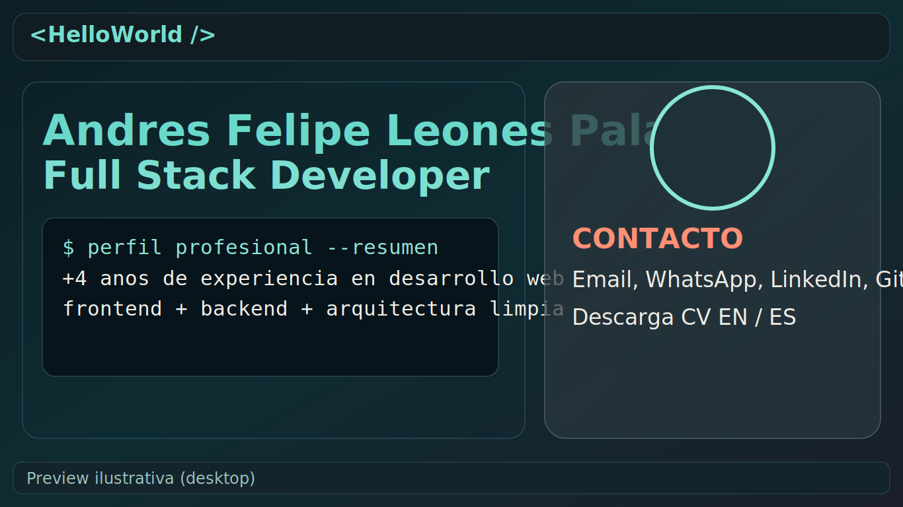
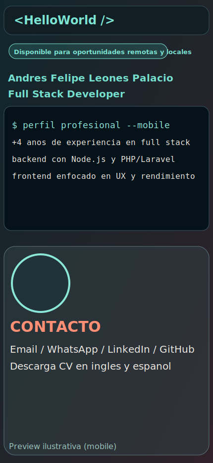

# Curriculum Web - Andres Leones

Sitio web personal tipo CV/portfolio construido con Astro. Presenta el perfil profesional de Andres Leones como Full Stack Developer, con enfoque visual moderno, animaciones, secciones por anclas y contenido bilingue (ES/EN).

## De que trata el proyecto

Este proyecto es una landing page de curriculum que centraliza:

- Perfil profesional y resumen de experiencia.
- Datos de contacto y enlaces a redes.
- Logros, habilidades, metricas de dominio y stack tecnico.
- Experiencia, proyectos y educacion.
- Descarga del CV en ingles y espanol.

Ademas, incluye una navegacion responsive (desktop y mobile), animaciones suaves y una identidad visual orientada a tecnologia.

## Capturas de pantalla

### Vista desktop



### Vista mobile



## Tecnologias usadas

- Astro
- TypeScript
- CSS personalizado

## Estructura principal

```text
/
├── public/
│   ├── curriculum/
│   │   ├── cv-english.pdf
│   │   └── cv-spanish.pdf
│   └── profile.jpeg
├── src/
│   ├── layouts/
│   │   └── Layout.astro
│   └── pages/
│       └── index.astro
└── README.md
```

## Como ejecutar el proyecto

1. Instala dependencias:

```bash
npm install
```

2. Inicia el entorno de desarrollo:

```bash
npm run dev
```

3. Abre en el navegador:

```text
http://localhost:4321
```

## Scripts disponibles

- `npm run dev`: inicia el servidor de desarrollo.
- `npm run build`: genera la version de produccion en `dist/`.
- `npm run preview`: levanta una vista previa de la build.

## Autor

Andres Felipe Leones Palacio
